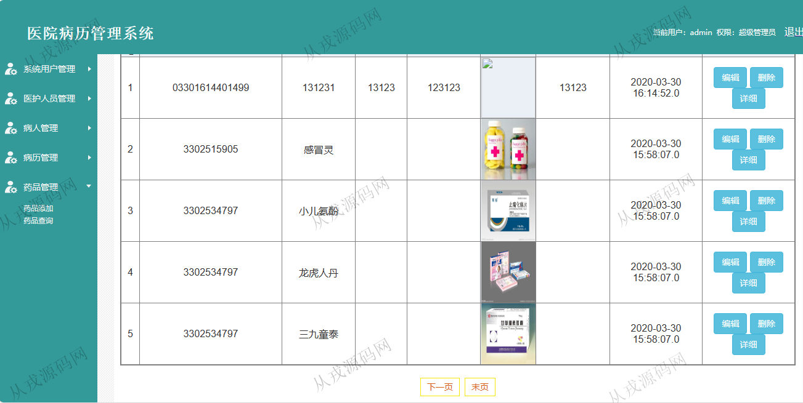
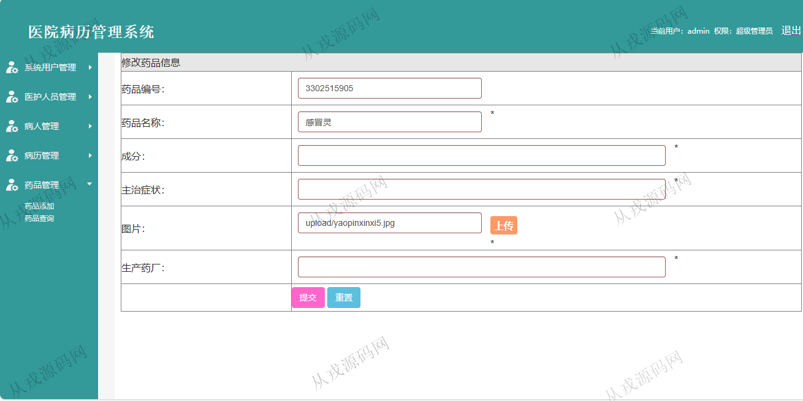
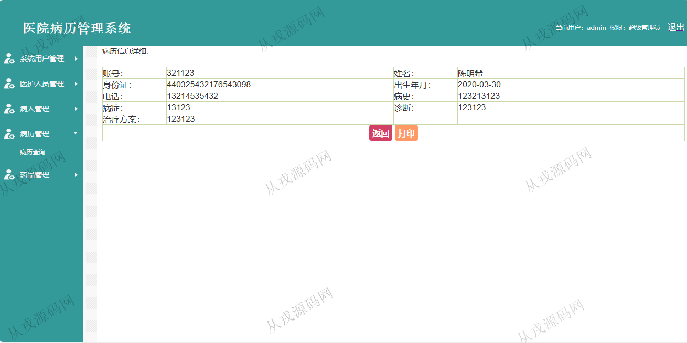
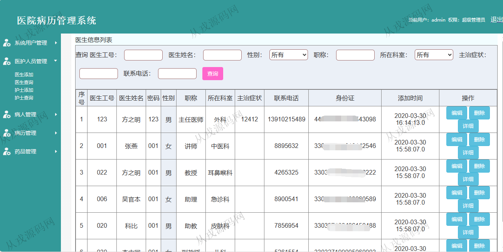
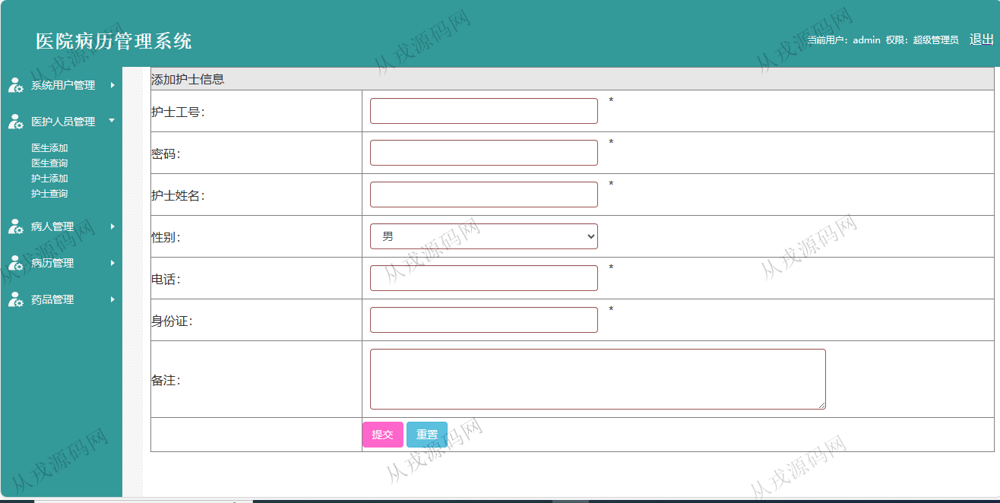
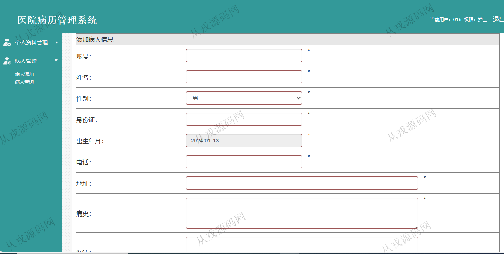
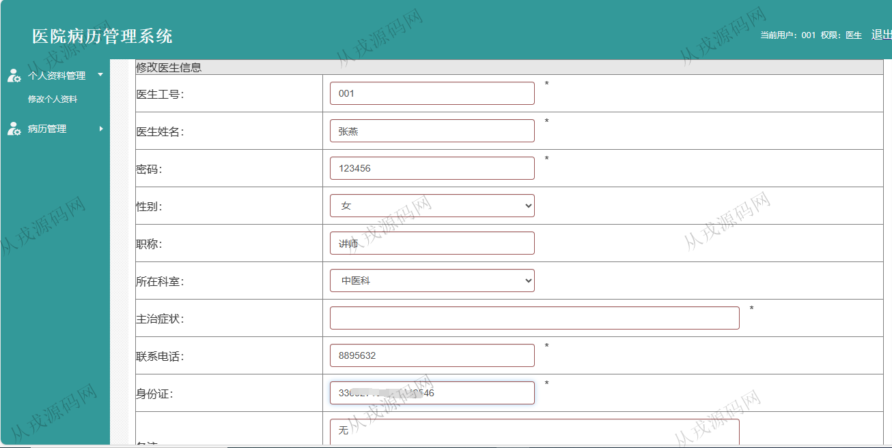

<h1 align="center">153.医院病历管理系统</h1>

- <b>完整代码获取地址：从戎源码网 ([https://armycodes.com/](https://armycodes.com/))</b>
- <b>技术探讨、资料分享，请加QQ群：692619798</b> 
- <b>作者微信：19941326836  QQ：952045282</b> 
- <b>承接计算机毕业设计、Java毕业设计、Python毕业设计、深度学习、机器学习</b>
- <b>选题+开题报告+任务书+程序定制+安装调试+论文+答辩ppt 一条龙服务</b>
- <b>所有选题地址 ([https://github.com/YuLin-Coder/AllProjectCatalog](https://github.com/YuLin-Coder/AllProjectCatalog)) </b>

## 项目介绍
基于ssm的医院病历管理系统：前端 jsp、ajax，后端 springmvc、spring、mybatis；角色分为管理员、护士、医生；集成病人管理、病历管理、药品管理等功能于一体的系统。

## 功能介绍

- 系统用户管理：管理员账户的增删改查，按用户模糊搜索，密码修改
- 医护人员管理：医生信息的增删改查，护士信息的增删改查
- 病人管理：病人信息的增删改查，多条件查询
- 病历管理：病历信息的增删改查
- 药品管理：药品信息的增删改查，多条件查询，药品图片上传

## 环境

- <b>IntelliJ IDEA 2021.3</b>

- <b>Mysql 5.7.26</b>

- <b>Tomcat 7.0.73</b>

- <b>JDK 1.8</b>

## 运行截图

